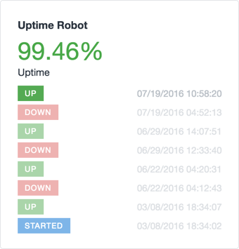

# Uptime Robot plugin for Craft CMS

Integrates with Uptime Robot to monitor the health of your Craft site.

## Installation

To install Uptime Robot, follow these steps:

1. Download & unzip the file and place the `uptimerobot` directory into your `craft/plugins` directory
2.  -OR- do a `git clone https://github.com/sjelfull/uptimerobot.git` directly into your `craft/plugins` folder.  You can then update it with `git pull`
3.  -OR- install with Composer via `composer require sjelfull/uptimerobot`
4. Install plugin in the Craft Control Panel under Settings > Plugins
5. The plugin folder should be named `uptimerobot` for Craft to see it.  GitHub recently started appending `-master` (the branch name) to the name of the folder for zip file downloads.

Uptime Robot works on Craft 2.4.x and Craft 2.5.x.

## Uptime Robot Overview

Makes a widget available that shows average uptime and event log.

## Configuring Uptime Robot

Follow the instructions in the settings screen

## Using Uptime Robot

The widget will cache the results for 5 minutes.

## Uptime Robot Changelog

### 1.0.1 -- 2016.07.19

* [Fixed] Removed the CP trigger part of the uptime check URL

### 1.0.0 -- 2016.07.19

* Initial release

Brought to you by [Fred Carlsen](http://sjelfull.no)
